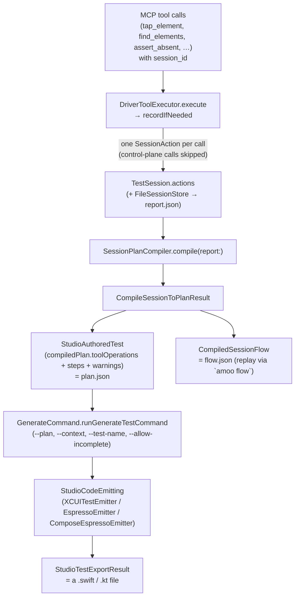

# Recording → plan → generated test

How a driven session becomes a standalone XCUITest / Espresso file. Read this before touching
`SessionPlanCompiler`, the emitters, session recording in `ToolExecutor`, or the MCP `initialize`
instructions — the logic is spread across several modules and two tool vocabularies, and the
connections are not obvious from any single file.

## Data flow

Entry points that drive this offline (no `amoo mcp serve`):

- `amoo generate plan --report report.json [--context …] --out dir/` — step D only
  (`Sources/CLI/GeneratePlanCommand.swift`).
- `amoo generate test --plan plan.json [--context …]` — steps H–I
  (`Sources/CLI/GenerateCommand.swift`).
- MCP `end_session` — step D on session close, writing `plan.json` + `flow.json` via
  `SessionArtifactWriter`. This is the canonical path: an agent ends the session, then inspects
  and generates.
- MCP `compile_session_to_plan` — the same step D, but callable while the session is still open.
  An *optional preview*; it does not change the plan `end_session` writes, and (like every
  lifecycle call) it is never recorded as an app step.

## Who owns what

| Stage | Module / file | Notes |
| --- | --- | --- |
| Record a tool call as a `SessionAction` | `MCPServer` — `ToolExecutor.recordIfNeeded` | Skips `controlPlaneTools`. Assigns `SessionAction.Intent` (`testStep` / `assertion` / `diagnostic` / `failedProbe` / `recovery`). Redacts secret args. |
| Session state + persistence | `TestSession` — `TestSession`, `SessionManager`, `SessionStore`, `SessionReport` | `report.json` date handling: `SessionReport.makeJSONEncoder()/makeJSONDecoder()` **only**. |
| Compile a report into a plan | `MCPServer` — `SessionPlanCompiler` (`+Semantics`, `+Inspection`, `+Translation`) | Deterministic, no LLM. |
| Plan / context / warning types | `StudioProtocol` — `StudioChatService.swift` (`StudioAuthoredTest`, `StudioTestContext`, `StudioToolOperation`, `StudioCompiledPlan`, `StudioPlanWarning`), `StudioTool.swift`, `StudioCodeExport.swift` | The wire format for `plan.json`. |
| Emit source | `TestCodeGenerator` — `XCUITestEmitter`, `EspressoEmitter`, `ComposeEspressoEmitter`, `TestCodeEmitter.swift` (shared naming), `HelperBinder` | `MCPServer` does **not** depend on this module. |
| MCP agent guidance | `MCPServer` — `MCPStdioServer.instructions`; `skills/driving-amoo/SKILL.md` | Kept in lock-step by `MCPInstructionsAlignmentTests` + `IOSSessionCodegenRegressionTests`. |

## Two tool vocabularies — do not conflate

- **MCP-exposed tools** (what an agent calls, what `initialize` / skills / tool schemas name):
  `assert_absent`, `start_session`, `end_session`, `swipe_in_direction`, `tap_element`, …
  Defined in `Sources/MCPServer/Tools/*.swift`, dispatched in `ToolExecutor+Dispatch.swift`.
- **Compiled-plan vocabulary** (`StudioTool`, what `plan.json` / emitters / `StudioAutomationService`
  use): `assert_not_visible`, `assert_enabled`, `tap_element`, …
  `SessionPlanCompiler.translate` maps MCP names onto these (`assert_absent` → `assert_not_visible`).

So `assert_not_visible` in an emitter or fixture is correct; agent-facing text must say
`assert_absent`. Adding a tool means updating both sides plus every `switch StudioTool` (no
`default:` — the compiler enforces exhaustiveness).

## Control-plane calls never become test steps

amoo's own lifecycle tools (`start_session`, `end_session`, `compile_session_to_plan`,
`list_sessions`, `get_session_report`) are not application actions:

1. `ToolExecutor.recordIfNeeded` (`ToolExecutor.controlPlaneTools`) — never written to history.
2. `SessionPlanCompiler.process` (`SessionPlanCompiler.controlPlaneTools`) — backstop for older
   recordings / hand-edited reports: classified `.notApplicable`, **not** `.excluded`, so a stray
   one cannot trip the incomplete-plan gate or produce a trailing `XCTFail`.

A recorded `compile_session_to_plan` still carries a useful `test_name` / `test_description`;
`SessionPlanCompiler.compile` recovers those when the report itself lacks them.

## Where variable names are decided

Three cooperating layers — a change in the wrong one is silently overridden:

1. **Compiler, semantic hints** (`SessionPlanCompiler+Semantics.swift`) — writes naming-only args
   onto operations, never touching the selector or step text:
   - `attachObservedLabel` — carries a `find_elements` label onto an id-only selector as `name_hint`.
   - `attachGestureTargetLabel` — carries a row label onto an element-scoped
     `swipe_in_direction` / `scroll` as `element_label`.
   - `annotatePresetOptionTaps` — a bare-label tap in a create → choose → confirm flow gets
     `name_hint = "<label> preset option"` so a picker option (`waterPresetOption`) does not
     collide with the catalog row of the same name (`waterHabitRow`).
2. **Emitter, name derivation** (`TestCodeEmitter.swift` — `TestIdentifierNaming.elementVariableBase`):
   label / role / container tokens from the label and the accessibility-id path; opaque tokens
   (UUIDs, hashes, numeric ids) are dropped, never used in an identifier. `name_hint` wins over the
   raw label.
3. **Emitter, collision resolution** (`LocalNameAllocator`) — appends a deterministic numeric
   suffix only when two genuinely distinct selectors still derive the same base.

## Generated-test context

`StudioTestContext` (in the plan's `testContext`, or via `--context`, or via MCP
`context_path` / `context_json` persisted on the session) supplies the host app's base class, app
factory, launch behavior, imports, reusable helpers, and id catalog. Generation never guesses:
a helper is emitted only for an operation whose planner bound it; a selector is rewritten only for
an id listed in `selectorExpressions`. Full schema: [`test-context.md`](test-context.md).

## The `--allow-incomplete` gate

`amoo generate test` refuses to emit when `compiledPlan` has `excluded` warnings (a recorded step
with no `StudioTool` equivalent — usually a raw coordinate tap on an unidentified element). Fixing
the recording (add an accessibility id, drive through an addressable ancestor, re-record) is the
intended response. `--allow-incomplete` emits anyway and inserts an `XCTFail` at the exact missing
application step — never for a lifecycle call (those are `.notApplicable`, see above).

## Tests that lock this down

- `Tests/MCPServerTests/SessionPlanCompilerTests.swift`, `SessionPlanCompilerSemanticsTests.swift`,
  `SessionPlanCompilerRetryTests.swift` — compiler behavior.
- `Tests/MCPServerTests/SessionCodegenContextTests.swift` — MCP session/compile-time context.
- `Tests/MCPServerTests/MCPInstructionsAlignmentTests.swift` — `initialize` text ↔ exposed tools.
- `Tests/TestCodeGeneratorTests/*` — emitter output, naming, golden fixtures, real compilation.
- `Tests/IntegrationTests/IOSSessionCodegenRegressionTests.swift` — the full record → compile →
  generate acceptance scenario, end to end.
- `Tests/CLITests/GenerateCommandTests.swift`, `GeneratePlanCommandTests.swift` — the CLI surface.
