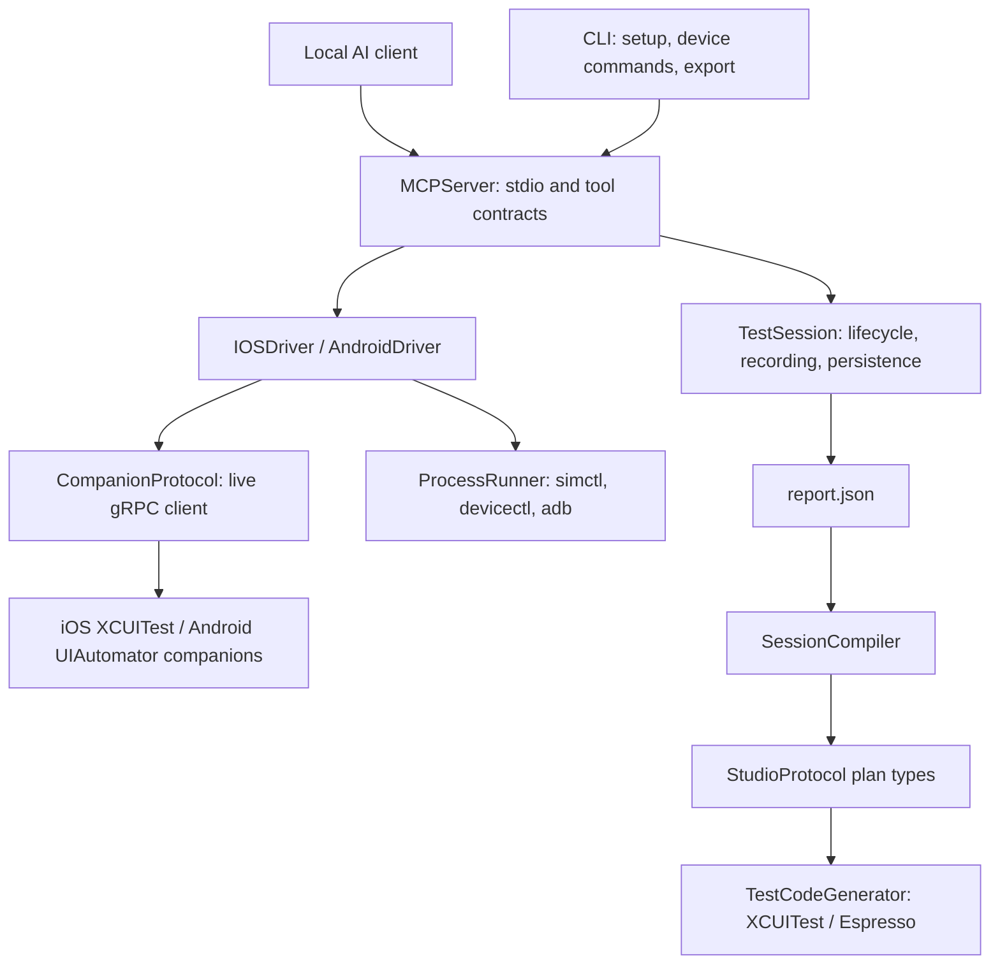

# Current runtime architecture

This is the implemented module map. `Architecture.md` preserves the broader design and roadmap;
it is not a support certification. `Package.swift` is the source of truth for dependency edges.

`AmooCore` owns platform-neutral capabilities, selectors, geometry and observations. `Protos`
defines the shared wire contract. Host tools own installation, booting and USB forwarding;
companions own UI access and gestures. `GRPCService` exposes the service adapter. `AuditEngine`
evaluates explicit screen evidence; `WebInspector` handles inspectable WebViews.

`SessionCompiler` is independent of the MCP transport. MCP re-exports it for existing source
clients, while the CLI imports it directly. The plan model currently remains in `StudioProtocol`;
extracting a separate plan model would be a later public API migration.

## Ownership and concurrency

The MCP reader accepts bounded newline-delimited frames. `MCPRequestRuntime` tracks at most 64
request tasks, accepts cancellation and serializes complete response writes. A device queue
serializes device operations; independent device keys can execute concurrently. Lifecycle setup
uses process-local device leases. These guarantees do not coordinate separate Amoo processes;
use one server per device and dedicated hardware runners.

A screen observation derives its context, element list and change token from one scoped hierarchy
RPC. Subsequent calls observe fresh state. Tokens are not snapshot handles: UI changes can still
occur between target resolution and gesture dispatch. Callers should use semantic selectors and
explicit postconditions. The companion refuses ambiguous direct tap/text matches.

Session actions normalize coordinate units to points before recording. Reports redact known secrets
and snapshot codegen intent, including supplied app-owned context JSON. A timer persists pending
history after five seconds and shutdown drains pending writes. The file store uses atomic report
replacement and restrictive artifact permissions. It returns recording health and logs persistence failures without exposing
raw OS errors or user data. Current batching reduces write frequency but still rewrites history;
it is not an append-only journal. Session listing reads lightweight summary indexes with fallback for legacy or stale indexes.
At most 32 successfully persisted closed sessions retain live driver/history objects; older reports
load on demand. Disk artifacts have no automatic deletion policy.

## Validation boundaries

Unit tests exercise contract mapping, routing, compiler semantics, cancellation and redaction.
Companion builds are separate from `swift build`. Strict smoke CI exercises fixture launch,
hierarchy queries, navigation and text entry on simulators/emulators. Physical qualification is
opt-in on dedicated hardware. See [support matrix](support-matrix.md) for configuration and gaps.

Coverage gates currently enforce root 67%, AmooCore 70%, the combined driver/protocol group 74%,
and CLI 45%. The coverage script also prints individual module coverage. These are configured
floors, not a measurement of the current checkout, and there is no automatic one-percent
change-versus-base gate. Raise the floors only from a reproducible covered run.
